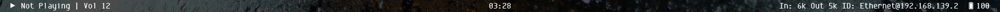
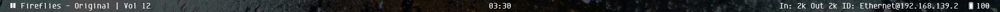
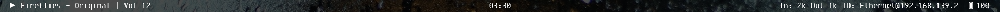
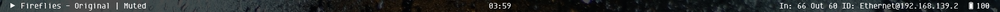

# Rainmeter Bar

A minimal bar across the top of your screen. Requires Rainmeter.

Written by Guppy0130/Nick Yang. Licensed under GNU GPLv3.

## Changelog
02/16/18: First Release. Comes with SpotifyPlugin v1.9.3.0, written in Win10 + Rainmeter 4.2.0r3029

## Screenshots
### Ethernet




### Wireless


## Installation
Install the font [Envy Code R](https://damieng.com/blog/2008/05/26/envy-code-r-preview-7-coding-font-released)  
Use the `.rmskin` package (which will load the theme automatically), or install manually:

```powershell
cd $env:userprofile/Documents/Rainmeter/skins
# or where your rainmeter installation is
git clone https://github.com/guppy0130/rainmeter-bar.git
# or git clone https://gitlab.com/guppy0130/rainmeter-bar.git
```

Open Rainmeter, open folder `rainmeter-bar`, and double-click `Bar.ini` to load it.

## Modifying
Modify `Bar.ini` (fonts, measures, plugins, etc). Please refer to `LICENSE` for proper citations. A `LICENSE` file should be available in all derivatives of this work, as well as the original work itself.
